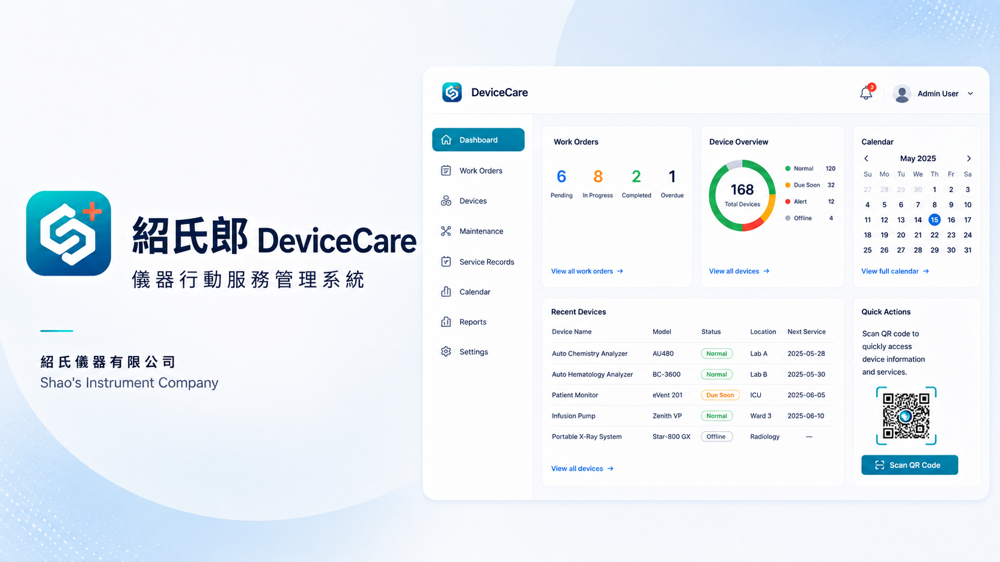

# 紹氏郎 DeviceCare — 互動展示版

[開啟互動展示網站](https://s960137.github.io/devicecare-demo/)

這是「紹氏郎 DeviceCare 儀器行動服務管理系統」的獨立展示專案，用於呈現產品介面、資訊架構與主要操作流程。

## 展示內容

- 響應式首頁與即時統計
- 客戶單位及聯絡人
- 儀器基本資料、財產編號、保固與生命週期
- 交機、保養及維修工單
- 保養排程與開放工程師承接
- 工程師服務統計
- 電腦與手機版介面

## 資料與安全說明

本 Repository 與正式系統完全分離：

- 所有名稱、電話、Email、序號與工單皆為虛構資料。
- 不連接正式 Supabase 資料庫或檔案空間。
- 不包含正式帳號、密碼、API Key、客戶資料或 Email 寄送設定。
- 展示操作只在瀏覽器畫面執行，不會寫入或寄送任何資料。

正式系統的原始碼與資料庫維持在私人環境，不在此公開。

## 技術形式

展示版採用原生 HTML、CSS 與 JavaScript，可直接由 GitHub Pages 提供固定網址，不需要後端服務。

© 2026 紹氏儀器有限公司／紹氏郎 DeviceCare
